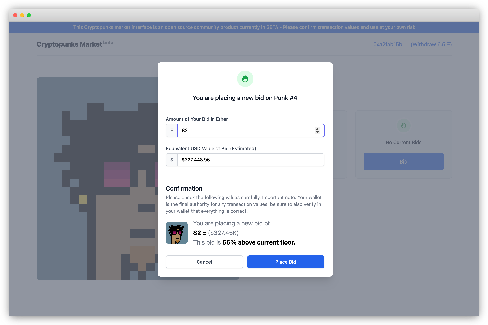

## Cryptopunks Market

[](https://dashboard.cypress.io/projects/beem87/runs)
[](https://circleci.com/gh/larvalabs/cryptopunksmarket)

This is an open source, single page decentralized market for [The Cryptopunks](https://larvalabs.com/cryptopunks). The latest build is available for use at [cryptopunks.market](https://cryptopunks.market).



## Overview

The Cryptopunks are an (almost) 5 year old experiment in generative art and decentralized digital ownership. The [smart contract](https://etherscan.io/address/0xb47e3cd837ddf8e4c57f05d70ab865de6e193bbb#code) that defines ownership of the punks also includes a decentralized marketplace that charges no transaction fees. This smart contract can never be updated or modified by anyone, including the original developers. This project is an interface into that marketplace that ensures the Cryptopunks will always have an open, zero fee, method of transaction with no reliance on any person or corporate entity.

## Usage

```
THIS MARKET CODE HAS NOT YET COMPLETED TESTING AND IS NOT YET RECOMMENDED FOR MAINNET TRANSACTIONS

This Cryptopunks market interface is an open source community product currently in BETA.
Until testing has been completed we do not recommend using it for MainNet transactions.
Any transactions are performed entirely at your own risk.
```

The latest build of this code is automatically deployed to [cryptopunks.market](https://cryptopunks.market) and is available for use there. To view a specific punk simply use the `index` parameter, for example [punk #9](https://cryptopunks.market/?index=9).

## Code

To improve the durability and maintainability of the code in this project we strive for maximum simplicity and minimal dependencies. To that end, all source is included as fixed-version static files and there is no build process or dependency manager. We welcome pull requests to help improve the market, thank you!

## Bugs and feature requests

Have a bug or a feature request? Please first search for existing and closed issues. If your problem or idea is not addressed yet, [please open a new issue](https://github.com/larvalabs/cryptopunksmarket/issues/new).

## Acknowledgements

This project makes use of the following open source projects, thank you to their authors and maintainers!

- [Web3.js](https://github.com/ChainSafe/web3.js)
- [Vue.js](https://github.com/vuejs/vue)
- [Tailwind CSS](https://github.com/tailwindlabs/tailwindcss)
- [Tailwind CSS](https://github.com/tailwindlabs/tailwindcss)